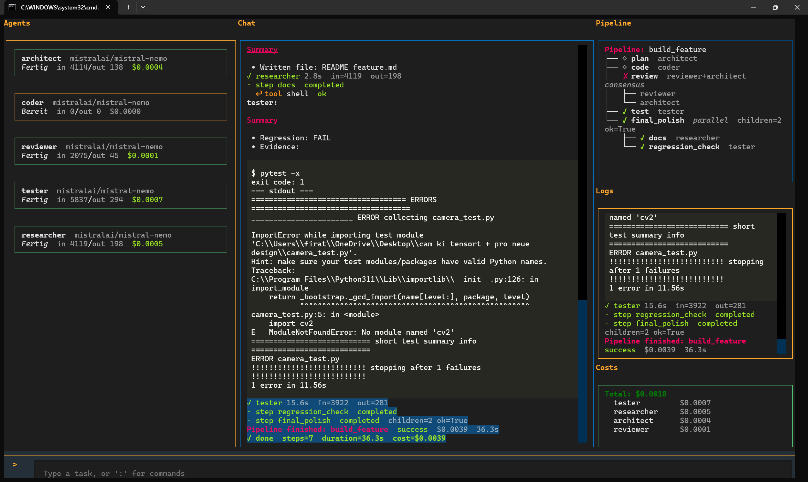
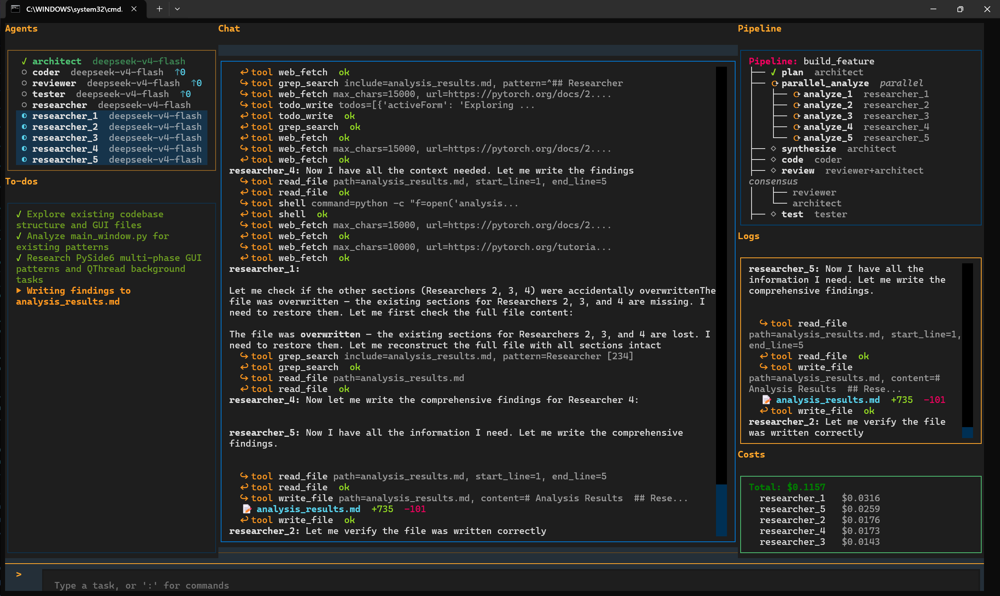
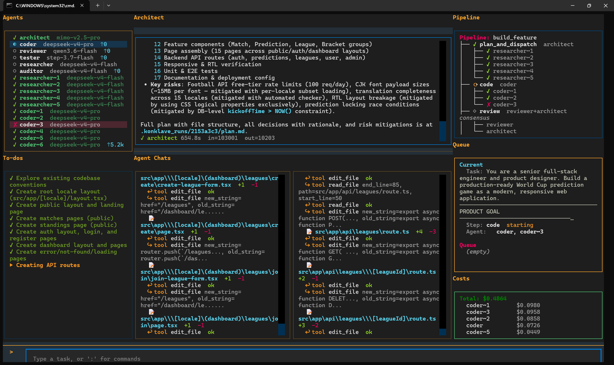
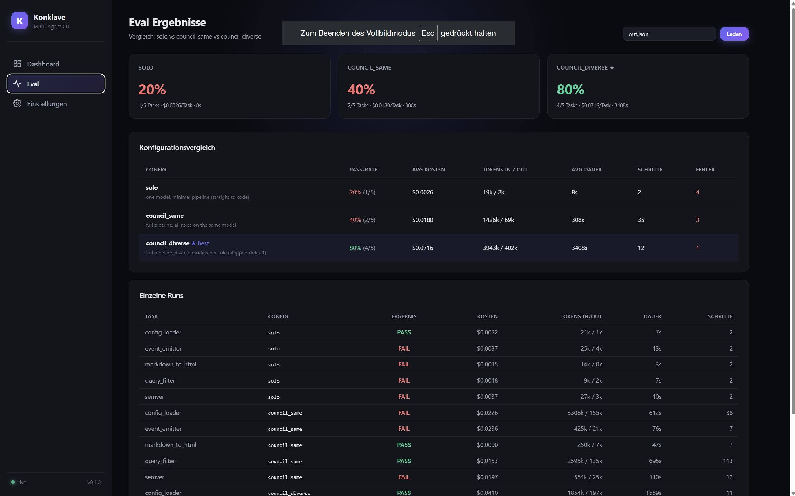
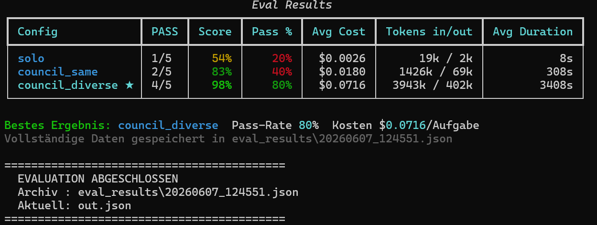

<div align="center">

## 🌐 [**konklave.info**](https://konklave.info)

<br/>

# 🏛️ &nbsp;K&nbsp;O&nbsp;N&nbsp;K&nbsp;L&nbsp;A&nbsp;V&nbsp;E

### A council of AI models that thinks, codes, reviews, and ships — together.

<br/>

### 🚀 Releases June 15, 2026

<br/>

[](https://python.org)
[](https://openrouter.ai)
[](LICENSE)
[](https://github.com/firo2525/konklave/releases)

<br/>

> **Stop talking to one AI. Run a team.**
>
> Konklave orchestrates six specialized agents — Architect, Coder, Reviewer, Tester, Researcher, Auditor —
> across any mix of models from OpenRouter. They catch each other's mistakes so you don't have to.

<br/>

</div>

---

## 🎬 Screenshots

<div align="center">

**Full pipeline run — Agents · Chat · Pipeline graph · Live cost tracking**


<br/>

**Swarm mode — 6 Researchers running in parallel, all writing findings simultaneously**


<br/>

**Architect planning a large feature — 6 Coders spawned in parallel**


<br/>

**Web Dashboard — live runs, eval comparison, settings**


<br/>

**Eval results in the terminal — solo vs council, head to head**


</div>

---

## ✨ How It Works

Instead of one model doing everything, Konklave runs an actual **pipeline of specialists**:

```
┌─────────────────────────────────────────────────────────────────┐
│                                                                 │
│   📝 You describe the task                                      │
│          │                                                      │
│          ▼                                                      │
│   🏛️  Architect  ──spawns──►  🔍 Researcher × N (parallel)    │
│          │                                                      │
│          ▼  concrete plan                                       │
│   💻  Coder       (different model family — blind spots cancel) │
│          │                                                      │
│          ▼  implementation                                      │
│   🔎  Reviewer  ──╮                                            │
│                   ├──► consensus vote                          │
│   🛡️  Auditor   ──╯                                            │
│          │                                                      │
│          ▼  approved                                            │
│   🧪  Tester     (runs real commands, reads real output)       │
│          │                                                      │
│          ▼                                                      │
│   ✅  Result                                                    │
│                                                                 │
└─────────────────────────────────────────────────────────────────┘
```

Each role runs on **the model you choose**. Mix providers freely — a DeepSeek coder with Anthropic reviewers means genuinely independent cross-checks, not just one model second-guessing itself.

---

## 🧠 Six Specialized Roles

| Role | What it does |
|:----:|:------------|
| 🏛️ **Architect** | Reads your codebase, spawns parallel Researchers, writes a concrete step-by-step plan |
| 💻 **Coder** | Implements the plan — intentionally assigned a different model family than the reviewers |
| 🔎 **Reviewer** | Checks the implementation against the plan and your coding standards |
| 🧪 **Tester** | Runs actual commands and verifies the result with real evidence, not guesses |
| 🛡️ **Auditor** | Final pass — does the output actually solve the original request? |
| 🔍 **Researcher** | Lightweight parallel lookups, runs in swarms to gather context fast |

---

## ⚡ Work Modes

One flag to control how deep the pipeline goes:

```bash
konklave run "your task" --work very_fast    # ⚡ instant — straight to code, no research
konklave run "your task" --work fast         # 🚀 quick research + light review
konklave run "your task"                     # ⚖️  balanced default
konklave run "your task" --work deep         # 🔬 multi-round review and testing
konklave run "your task" --work autonomous   # 🤖 autonomous loop until PERFECT
```

| Mode | Speed | What runs |
|------|:-----:|-----------|
| `very_fast` | ⚡⚡⚡ | No research → code → done |
| `fast` | ⚡⚡ | One researcher, quick review |
| `balanced` | ⚖️ | Research → plan → code → review → test |
| `deep` | 🔬 | Multi-researcher, multiple review/test rounds |
| `exhaustive` | 🧬 | Exhaustive edge cases, trade-off exploration |
| `autonomous` | 🤖 | Loop until Auditor approves (with budget cap) |
| `auto-endless` | ♾️ | Loop until you stop it |

---

## 🌊 Swarm — Parallel Sub-Agents

Agents can spawn their own helpers for genuinely independent sub-tasks. Three Researchers run at once instead of sequentially. You control the aggressiveness:

```
:swarm off            →  each agent works alone
:swarm encouraged     →  agents use parallel helpers when it makes sense  (default)
:swarm aggressive     →  maximally fan out work to sub-agents
```

---

## 🌐 Web Search — Live Internet Access

Let agents pull in current information — library versions, release notes, recent
events, exact error strings — via OpenRouter's native web search. No extra API
key or search provider needed. Three levels:

```
:websearch off      →  no search (training data only)          (default)
:websearch auto     →  a web_search tool the agent calls itself when it needs to
:websearch always   →  every request grounded with live web search
```

- **`auto`** gives each agent a `web_search` tool; it decides when current info
  is worth a lookup, then can `web_fetch` a cited URL for the full page.
- **`always`** grounds *every* model request — most thorough, adds a small
  per-search cost.

---

## 🧠 Semantic Code Search — Find Code by Meaning

Beyond exact-string `grep`, agents can search the workspace **semantically**:
"where do we validate the API key" finds the right function even if it never
uses those words. Powered by embeddings (default model
`google/gemini-embedding-2`), routed through OpenRouter.

```
:index on              →  enable; agents get a semantic_search tool
:index off             →  disable
:index status          →  model, dimensions, indexed files/chunks
:index model <id>      →  pick a different embedding model
:index rebuild         →  (re)embed the workspace now
```

- **Incremental & cached.** Only changed files are re-embedded (content-hashed);
  the index persists to `~/.konklave/index/` so a fresh session loads instantly.
- **Memory too.** With the index on, `MEMORY.md` search is ranked semantically
  under the same toggle — agents recall past knowledge by meaning, not keyword.
- Configurable via `:index`, the **Settings** screen, or `~/.konklave/config.toml`
  (`semantic_index`, `embedding_model`, `embedding_dimensions`).

---

## 🎮 Human-in-the-Loop

Inject a message mid-run, steer the direction, or just watch. Slash commands work in the TUI **at any time**:

| Command | What it does |
|---------|-------------|
| `:say "focus on auth"` | Inject a message into the active agent |
| `:work autonomous` | Switch work mode on the fly |
| `:swarm aggressive` | Turn up parallel agent spawning |
| `:ask proactive` | Make the Architect ask you more questions |
| `:websearch auto` | Let agents search the live web (off · auto · always) |
| `:index on` | Semantic code + memory search via embeddings |
| `:cost` | Show live USD spend per agent |
| `:models` | Reassign any role to a different model |
| `:exit` | Clean stop at the next step boundary |

---

## 📦 Built-in Pipelines

Pipelines are plain **YAML** — no Python required. Write your own or use the built-ins:

```
🏗️  build_feature    →  research + plan + code + review + test + audit
⚡  quick            →  one-shot coder, no review overhead
♻️  refactor         →  architect-led refactor with before/after review
🐛  debug_issue      →  reproduction → root cause → fix → regression test
🔍  research         →  deep research swarm, no code changes
🤖  autonomous_loop  →  loop until done (budget-capped)
```

---

## 🏗️ Architecture

```
 You (TUI / CLI)
       │
       ▼
 ┌─────────────┐     ┌──────────────────────────────────────┐
 │  Conductor  │────►│  Pipeline YAML                       │
 │             │     │  • sequential steps                  │
 │             │     │  • parallel groups                   │
 │             │     │  • consensus votes                   │
 │             │     │  • loop steps                        │
 │             │     │  • human-approval gates              │
 └─────────────┘     └──────────────┬───────────────────────┘
                                    │
              ┌─────────────────────┼────────────────────┐
              ▼           ▼         ▼          ▼          ▼
        Architect      Coder    Reviewer    Tester    Auditor
        (Sonnet)    (DeepSeek)  (Sonnet)   (Haiku)   (Sonnet)
            │
            └──spawns──► Researcher × N
                         (parallel swarm)
                              │
                              ▼
                       OpenRouter API
                  (any model, any provider)
```

**Key design decisions:**
- 🔒 Each agent has **isolated conversation history** — no cross-contamination
- 🔄 **Event Bus** decouples UI, Conductor, agents, and tools asynchronously
- 🛡️ **Fallback models** — if a model fails, the agent auto-retries on a backup
- 💾 **SQLite persistence** — every step saved, resume from any checkpoint

---

## 🤖 Default Model Panel

| Role | Model | Why |
|------|-------|-----|
| 🏛️ Architect | `anthropic/claude-sonnet-4.6` | Strong planning and tool use |
| 💻 Coder | `deepseek/deepseek-chat-v3` | Fast, cheap, excellent at code |
| 🔎 Reviewer | `anthropic/claude-sonnet-4.6` | Different family from coder → independent check |
| 🧪 Tester | `anthropic/claude-haiku-4.5` | Fast and cheap for test gates |
| 🔍 Researcher | `anthropic/claude-haiku-4.5` | High-volume parallel queries |
| 🛡️ Auditor | `anthropic/claude-sonnet-4.6` | Strict final quality gate |

Swap any role to any model on [OpenRouter](https://openrouter.ai/models) — use `:models` in the TUI or `konklave init`.

---

## 📊 Benchmarks

We run Konklave against a suite of self-contained coding tasks (each with a hidden test file) and score by the fraction of tests that pass. To keep it **fair, every configuration runs the exact same model** — `google/gemini-2.5-flash-lite` — so the comparison measures the *orchestration*, not a model upgrade. Three configurations, head to head:

- **solo** — minimal pipeline, straight to code (no review)
- **council_same** — the full pipeline: architect → coder → reviewer → tester → auditor
- **council_diverse** — the full pipeline with the orchestration turned up: **swarm high + autonomous work mode**

**Latest run — 2026-06-07 · 5 tasks per config · all on `gemini-2.5-flash-lite`**

| Configuration | Pass rate | Mean score | Mean cost | Mean time |
|---------------|:---------:|:----------:|:---------:|:---------:|
| `solo` | 20% (1/5) | 54% | $0.0026 | 8s |
| `council_same` | 40% (2/5) | 83% | $0.018 | 5m 8s |
| **`council_diverse`** | **80% (4/5)** | **98%** | **$0.072** | **57m** |

<div align="center">


</div>

**Takeaway:** with the **same model in every seat**, just adding the multi-agent pipeline (review + test + audit) doubles the pass rate over a single call (`solo` 20% → `council_same` 40%), and turning the orchestration up — swarm high + autonomous looping — doubles it again to **80%**, lifting the mean test score from 54% → 98%. The gains here come purely from **how the agents work together**, not from a stronger model.

### 🤖 Model under test

All three configurations ran on a single, cheap model so no config has a model advantage:

| Configuration | Model | What's different |
|---------------|-------|------------------|
| `solo` | `google/gemini-2.5-flash-lite` | minimal pipeline — straight to code |
| `council_same` | `google/gemini-2.5-flash-lite` | full pipeline — review, test, audit |
| `council_diverse` | `google/gemini-2.5-flash-lite` | full pipeline **+ swarm high + autonomous work mode** |

> This isolates the value of the **orchestration itself**. In real use you can go further and assign a *different model family per role* (see [Default Model Panel](#-default-model-panel)) so independent models catch each other's blind spots on top of these gains.

> Cost and time scale with depth — deeper orchestration thinks longer and harder. Use the [work modes](#-work-modes) to dial the trade-off for your task. Full per-task results: [`eval_results/`](eval_results/).

---

## 💡 Why This Works — Buy Quality With Cheap Tokens

Here's the whole idea in one sentence: **spend more cheap tokens instead of paying for an expensive model — and let it happen on its own.**

A single call to a small, cheap model gets you a small, cheap answer (`solo`: 20% pass rate). But the *same cheap model*, when it's allowed to **review its own work, run the tests, see the failures, fix them, and loop again — autonomously — climbs to 80%**. Same model. The only thing that changed is that it kept working.

- 💸 **Cheap tokens, premium results.** A frontier model charges a premium per token for one shot. Konklave takes a model that costs a fraction of that and simply *uses more of it* — many small, cheap passes add up to an answer that rivals (or beats) the expensive one-shot, at a lower model tier.
- 🤖 **Fully autonomous — you don't babysit it.** You don't re-prompt, you don't paste error messages back in, you don't say "now write tests." The pipeline reviews, tests, audits, and re-tries by itself until the Auditor is satisfied (or the budget cap stops it). The extra token burn is *automatic*.
- 🔁 **More tokens are the feature, not a bug.** Yes — `council_diverse` uses far more tokens than a single call. That's the point: those tokens *are* the quality. You're trading something cheap (tokens from a small model) for something valuable (a correct, tested result) — and you set the ceiling with [work modes](#-work-modes) and a budget cap.

> **Bottom line:** don't pay for a smarter model — let a cheaper one think longer, automatically. More token burn, fully autonomous, better output.

---

## 🚀 Installation

**Requirements:** Python 3.11+ · [OpenRouter API key](https://openrouter.ai/keys) (free tier available)

```bash
pip install konklave
konklave init     # interactive setup: language, API key, default models
konklave          # launch TUI
```

> **Windows:** double-click `start.bat` — activates the environment and launches Konklave automatically.

---

## 🏁 Quickstart

```bash
# One-shot run
konklave run "Add input validation to the login form"

# With a specific depth
konklave run "Refactor the payment module" --work lang

# Full interactive TUI
konklave

# Resume an interrupted session
konklave resume

# Test your connection
konklave ping
```

---

## ⚙️ Configuration

```bash
konklave config    # show current settings
konklave init      # re-run the setup wizard
```

Config lives at `~/.konklave/config.toml`. Your API key is stored in the **OS keyring** (Windows Credential Manager / macOS Keychain / Linux SecretService) — never written to plain files.

---

## 📊 Web Dashboard

A FastAPI + browser dashboard for everything that's hard to see in a terminal: live runs, full conversation history, **eval comparisons**, and settings.

```bash
# Launch the dashboard on http://localhost:8000
python -m uvicorn konklave.dashboard.app:app --host 127.0.0.1 --port 8000
```

> **Windows:** double-click `start_dashboard.bat` — it sets up the environment, opens your browser, and starts the server.

- 📜 Browse and export any past session (Markdown / JSON)
- 📈 Compare eval runs side by side (the screenshot above)
- ⚙️ Edit configuration and per-role models from the browser
- 🔒 Binds to `127.0.0.1` only, with a same-origin CSRF guard — local by default

---

## 🧠 Persistent Memory

Konklave remembers across sessions. Two human-editable files plus full-text search over every past run:

| Store | What it holds |
|-------|---------------|
| `MEMORY.md` | Workspace-scoped facts the agents learn while working (auto-compacted when it grows too large) |
| `USER.md` | Global facts about you and your preferences, applied to every workspace |
| Session DB | SQLite + **FTS5** full-text index over all past messages — agents can search what happened before |

Memory lives under `~/.konklave/` and is **never committed** (it's in `.gitignore`) — it can contain conversation history and personal context. Agents read it at the start of a run and can write new facts via the memory tool.

> With the [semantic index](#-semantic-code-search--find-code-by-meaning) enabled (`:index on`), `MEMORY.md` recall is ranked by **meaning** (embeddings) instead of keywords — agents surface relevant past knowledge even when the wording differs.

---

## 💻 Platform Support

| Platform | Status |
|----------|:------:|
| Windows 10 / 11 | ✅ |
| macOS 13+ | ✅ |
| Linux | ✅ |

---

## 🧪 Development & Tests

Konklave ships with a **628-test** suite (unit, smoke, and integration) covering the pipeline engine, agents, tools, memory, the dashboard API, and the eval harness.

```bash
# Install with dev extras
pip install -e ".[dev]"

# Run the full suite
pytest

# Skip the TUI tests (need a real terminal) and the slow ones
pytest -m "not tui and not slow"

# Run the benchmarks yourself (real OpenRouter calls — costs money)
konklave eval run --configs solo,council_same,council_diverse
```

> **Windows:** `test.bat` runs the suite; `eval_run.bat` runs the benchmarks.

---

## 📄 License

MIT — see [LICENSE](LICENSE).

---

<div align="center">

Built with ❤️ using [OpenRouter](https://openrouter.ai) · UI powered by [Textual](https://github.com/Textualize/textual)

<br/>

⭐ **Star this repo if you find it useful!** ⭐

</div>
